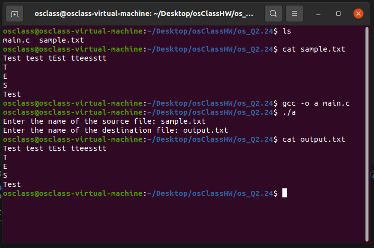

## Steps to run the program

- Open the terminal and navigate to the directory where the file **main.c**.
- To run

1.

```
gcc -o a main.c
./a
```

2. enter the name of input file(**sample.txt**)
3. enter the of output file(**output.txt**)

## Screenshots


