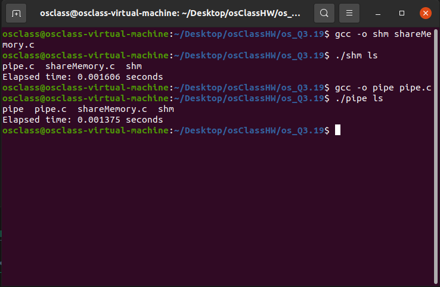

## Steps to run the program

- Open the terminal and navigate to the directory where the file **shareMemory.c** and **pipe.c**.
- To run

1.

```
gcc -o shm shareMemory.c
./shm ls
```

2.

```
gcc -o pipe pipe.c
./pipe ls
```

## Screenshots


