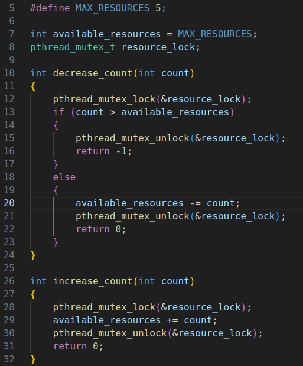

## Environment

- **Ubuntu 20.04.5 LTS**
- kernel version :**5.15.0-101-generic**

## Answer Question

- (a) Identify the data involved in the race condition.  
  Ans: **available_resources** ，這是共享變數，多個 processes 可能會同時修改。

- (b) Identify the location (or locations) in the code where the race condition occurs.  
  Ans: 特別在 **decrease count()** 中， 如果多個 processes 同時呼叫且資源不足滿足所有 processes 的需求時，available_resources 可能會減少到 0 以下，導致不正確的行為。

## Steps to run the program

- Open the terminal and navigate to the directory where the file **mutexLock.c**.
- To run

1.

```
gcc -o mutex mutexLock.c
./mutex
```

## Screenshots


