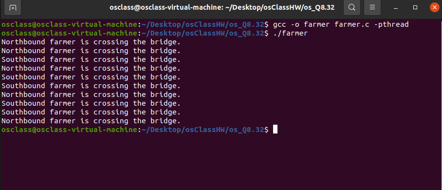

## Environment

- **Ubuntu 20.04.5 LTS**
- kernel version :**5.15.0-101-generic**

## Steps to run the program

(There are 5 farmers from the north and the south respectively.  
Wait 1 to 3 seconds to cross the bridge.)

- Open the terminal and navigate to the directory where the file **farmer.c**.
- To run

1.

```
gcc -o farmer farmer.c -pthread
./farmer
```

## Screenshots


