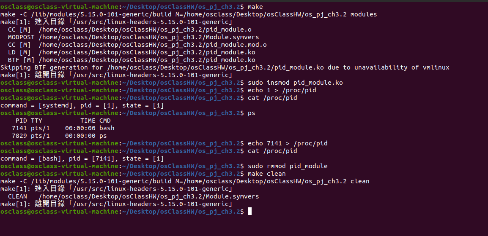

## Steps to run the program

- Open the terminal and navigate to the directory where the file **pid_module.c**.
- To run

1. install module

```
make
sudo insmod pid_module.ko
```

2.

```
echo 1 > /proc/pid
cat /proc/pid
```

3. remove module

```
sudo rmmod pid_module
make clean
```

other : enter ps can list of running processes

```
ps
```

## Screenshots


