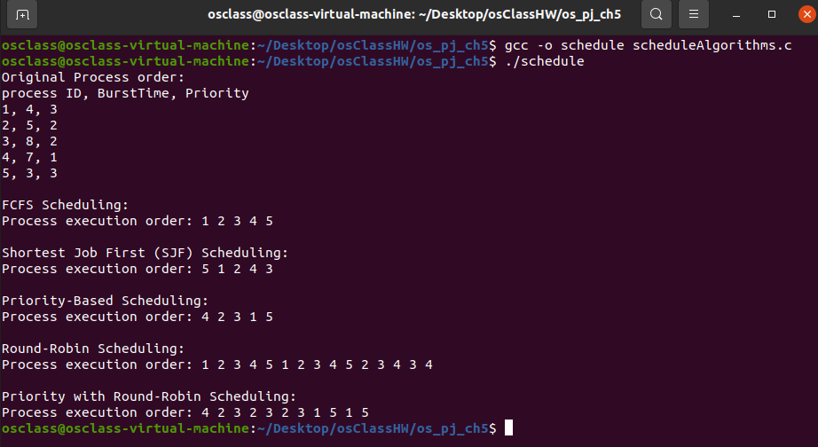

## Environment

- **Ubuntu 20.04.5 LTS**
- kernel version :**5.15.0-101-generic**

## Steps to run the program

- Open the terminal and navigate to the directory where the file **scheduleAlgorithms.c**.
- To run

1.

```
gcc -o schedule scheduleAlgorithms.c
./schedule
```

## Screenshots


