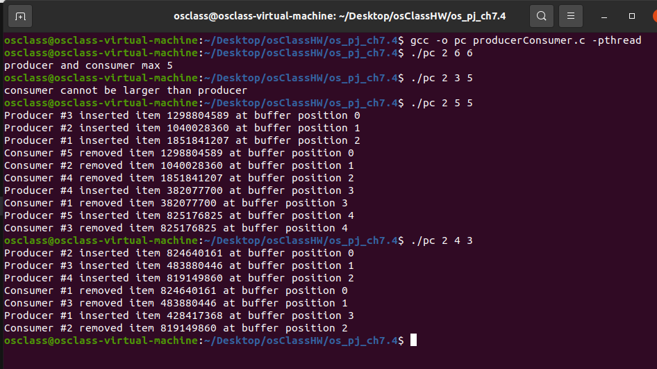

## Environment

- **Ubuntu 20.04.5 LTS**
- kernel version :**5.15.0-101-generic**

## Steps to run the program

- Open the terminal and navigate to the directory where the file **producerConsumer.c**.
- To run

```
gcc -o pc producerConsumer.c -pthread
./pc 2 5 5
```

three parameters on the command line:

1. How long to sleep before terminating
2. The number of producer threads
3. The number of consumer threads

**limit:**

1. producer and consumer thread max 5.
2. consumer cannot be larger than producer.
3. producer **can** be greater than or equal to consumer.

## Screenshots


